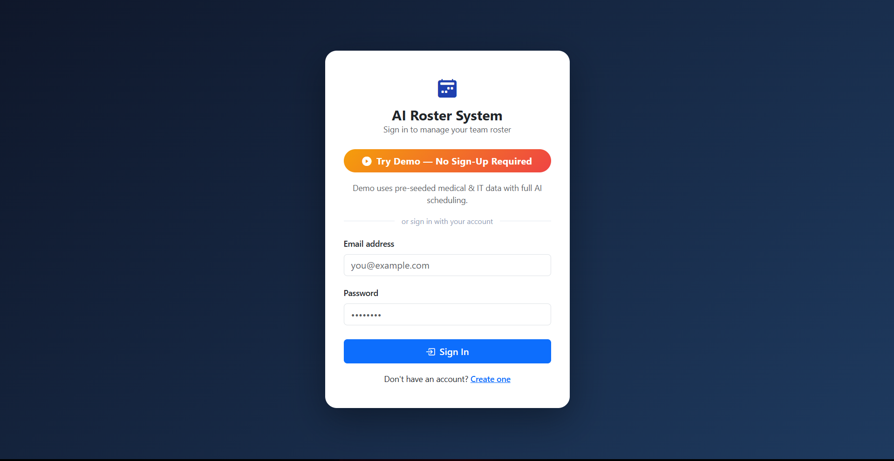
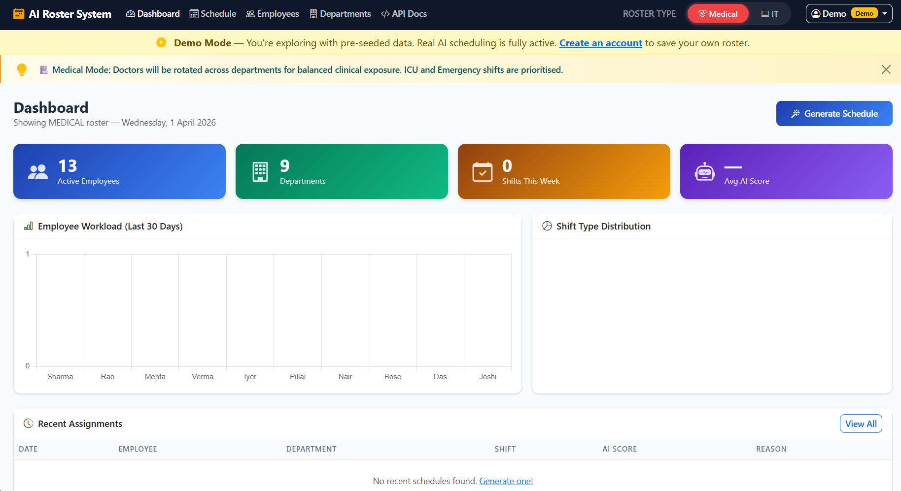
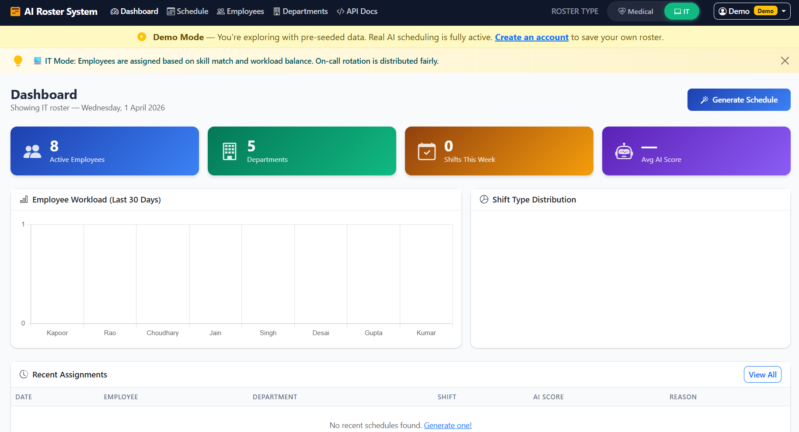
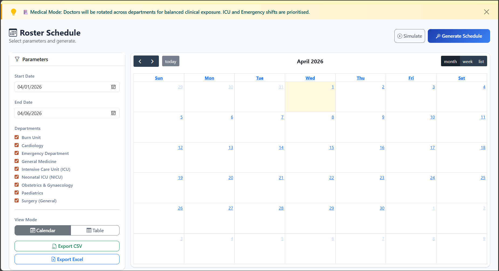
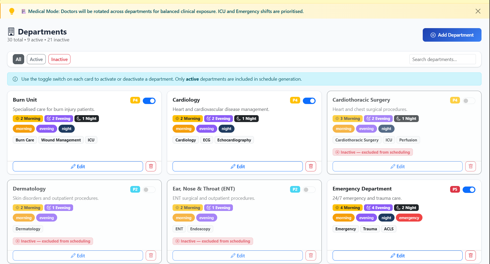

# AI-Powered Shift Planning & Roster System

A production-ready AI scheduling system for **Medical** and **IT** domains — with multi-user auth, per-user employee management, and a 5-agent AI engine.

## Live Demo

**[https://ai-roster-system.onrender.com](https://ai-roster-system.onrender.com)**

Click **"Try Demo — No Sign-Up Required"** to instantly explore with pre-seeded Medical & IT data.

---

## Screenshots

### Login Page


### Dashboard — Medical Mode


### Dashboard — IT Mode


### Roster Schedule — Calendar View


### Departments — Toggle Active/Inactive


---

## Quick Start (Local)

```bash
# 1. Clone and set up virtual environment
python -m venv .venv
.venv\Scripts\activate        # Windows
# source .venv/bin/activate   # Linux/macOS

# 2. Install dependencies
pip install -r requirements.txt

# 3. Run (auto-creates DB and seeds demo data)
python main.py
```

Open **http://localhost:8000** in your browser.

> **Demo credentials:** `demo@roster.app` / `demo1234`
> Or register your own account — each user gets a fully isolated workspace.

---

## Features

- **Multi-user auth** — JWT cookie-based login/register; each user owns their own employees and schedules
- **Try Demo** — one-click demo with 13 pre-seeded medical staff + 8 IT staff, no sign-up needed
- **5-Agent AI Engine** — LearningAgent → AvailabilityAgent → RotationAgent → OptimizationAgent → ConflictAgent
- **Medical domain** — 30 departments with activate/deactivate toggle, rotation-based scoring
- **IT domain** — skill-match scoring, on-call fairness
- **Schedule calendar** — FullCalendar 6 week/month/list views with shift colour coding
- **Export** — CSV and Excel download
- **REST API** — full Swagger docs at `/api/docs`

---

## AI Engine Pipeline

```
LearningAgent → AvailabilityAgent → RotationAgent
    → OptimizationAgent (Greedy) → ConflictAgent
```

### Medical Domain Rules
- Mandatory department rotation every 15 days
- Scoring: Rotation (40%) + Availability (30%) + Rest (20%) + Fairness (10%)
- Max 3 consecutive nights, min 8h rest between shifts
- ICU / Emergency load balancing

### IT Domain Rules
- Skill-based assignment (Python, Docker, AWS, etc.)
- Scoring: Skill Match (40%) + Workload (30%) + Availability (20%) + Weekend (10%)
- Max 2 consecutive nights, on-call rotation fairness

---

## Project Structure

```
Roster/
├── main.py                    # Entry point (local dev)
├── requirements.txt
├── Procfile                   # Render/Heroku startup
├── render.yaml                # Render deployment config
├── app/
│   ├── __init__.py            # App factory + startup hook
│   ├── config.py              # Settings (pydantic-settings)
│   ├── api/
│   │   ├── auth.py            # Login, register, demo, logout
│   │   ├── employees.py       # CRUD — scoped per user
│   │   ├── departments.py     # List, toggle active/inactive
│   │   ├── schedules.py       # Generate, list, export, override
│   │   └── ui.py              # Jinja2 page routes
│   ├── agents/                # 5-agent AI scheduling engine
│   ├── services/              # Business logic
│   ├── models/                # SQLAlchemy models
│   ├── db/                    # database.py + seed.py
│   ├── templates/             # Jinja2 HTML templates
│   └── static/                # CSS, JS (Bootstrap 5 + FullCalendar)
└── tests/                     # 19 pytest tests
```

---

## API Reference

| Method   | Path                            | Description                     |
|----------|---------------------------------|---------------------------------|
| `POST`   | `/api/auth/login`               | Login (form POST)               |
| `POST`   | `/api/auth/register`            | Register new account            |
| `POST`   | `/api/auth/demo`                | One-click demo login            |
| `POST`   | `/api/auth/logout`              | Clear auth cookie               |
| `GET`    | `/api/employees/`               | List your employees             |
| `POST`   | `/api/employees/`               | Create employee                 |
| `PUT`    | `/api/employees/{id}`           | Update employee                 |
| `DELETE` | `/api/employees/{id}`           | Soft-delete employee            |
| `GET`    | `/api/departments/all/list`     | All departments (inc. inactive) |
| `PATCH`  | `/api/departments/{id}/toggle`  | Toggle department active        |
| `POST`   | `/api/schedules/generate`       | **Run AI scheduling engine**    |
| `GET`    | `/api/schedules/`               | Fetch schedule entries          |
| `POST`   | `/api/schedules/override`       | Manual shift override           |
| `GET`    | `/api/schedules/export/csv`     | Export as CSV                   |
| `GET`    | `/api/schedules/export/excel`   | Export as Excel                 |

Full interactive docs: **[/api/docs](https://ai-roster-system.onrender.com/api/docs)**

---

## Running Tests

```bash
pytest tests/ -v
# 19 tests — availability, rotation, conflict detection, weekly caps
```

---

## Deployment

The app is deployed on **[Render](https://render.com)** with a free PostgreSQL database.

To deploy your own instance:
1. Fork this repo
2. Create a new **Blueprint** on Render and point it at your fork
3. Render reads `render.yaml` automatically — provisions the web service + PostgreSQL, runs migrations, and seeds the demo user

Environment variables set by `render.yaml`:

| Variable         | Description                        |
|------------------|------------------------------------|
| `DATABASE_URL`   | Auto-injected from Render Postgres |
| `SECRET_KEY`     | Auto-generated random value        |
| `DEMO_EMAIL`     | `demo@roster.app`                  |
| `DEMO_PASSWORD`  | `demo1234`                         |

---

## Local Configuration

Create a `.env` file to override defaults:

```env
DATABASE_URL=sqlite:///./roster.db
SECRET_KEY=your-secret-key
DEMO_EMAIL=demo@roster.app
DEMO_PASSWORD=demo1234
DEMO_FULL_NAME=Demo User
```
